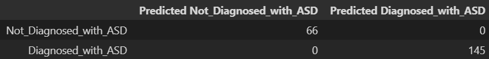
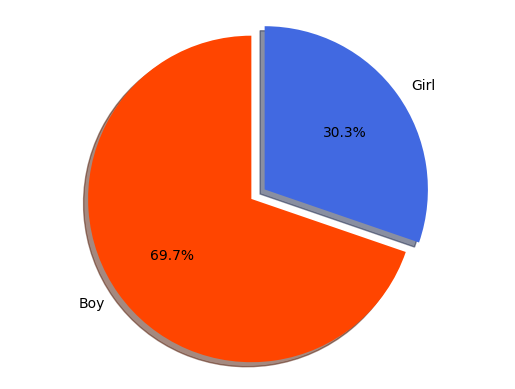
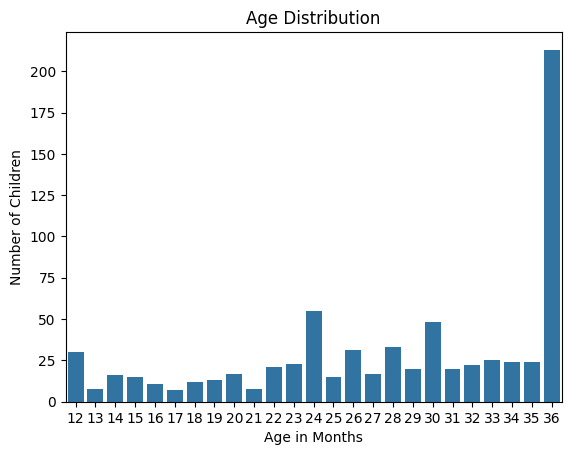
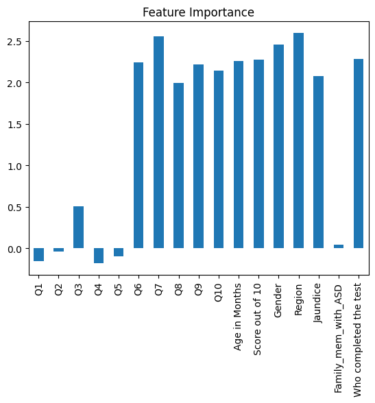

# Autism Detection for Early Childhood Screening

## Overview
This project aims to detect autism in early childhood screening using Support Vector Machine (SVM) machine learning models. Two models were developed to empower early intervention:

- **Autism_model.ipynb**: This notebook trains a model on a verified dataset from a reliable source. It includes code for training, confusion matrices, and compelling visualizations. 

- **Autism_input_model.ipynb**: This user-friendly notebook allows you to input data and leverage machine learning based on the trained model. It's designed to take user input and predict potential outcomes.

## Technologies Used

- Python
- Jupyter Notebook
- Support Vector Machine (SVM)
- Matplotlib (for Data Visualization)
- Seaborn (for Advanced Data Visualization)

## Model Results

**Visualizations:**
- 
- 
- 
- 

These visualizations offer valuable insights into the model's performance and data characteristics.

## Instructions

**Get Started:**

1. **Jupyter Notebook:** Ensure you have Jupyter Notebook installed. Alternatively, install the Jupyter extension in VS Code.
2. **Clone/Download:** Clone or download the project repository.
3. **Install Modules:** Install all required Python modules (instructions in notebooks).
4. **Run Models:** Open the respective notebooks:
   - `Autism_model.ipynb` (for in-depth exploration)
   - `Autism_input_model.ipynb` (for user input and predictions)
5. **Follow Instructions:** Each notebook provides detailed guidance on execution and interaction.

## Dataset

The dataset used for training and testing the models is obtained from a verified source (details provided within).

## Contributors

- KAMLESH BAHETI (Reach out: [kamleshbaheti2232@gmail.com](mailto:kamleshbaheti2232@gmail.com))

## License

This project is licensed under the Apache License 2.0.

## Let's Collaborate!

Feel free to contribute and improve this project! Your insights and expertise are valuable.

 
